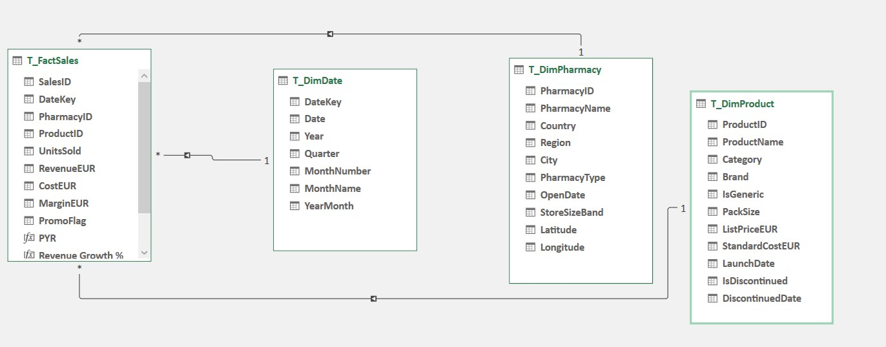

# 🏥 Pharmacy Sales & Profitability Analytics Dashboard

An end-to-end **Microsoft Excel** analytics project built on a simulated European pharmacy chain distributor dataset. The workbook covers the full analytics workflow — data modelling, cleaning, pivot analysis, and an interactive dashboard — across **8 countries**, **120 pharmacies**, and **220 products** over a **2-year period (2024–2025)**.

---

## 📊 Dashboard Preview

### Sales Summary


### Geographical Analysis


### Data Model


---

## 🎯 Project Objective

This project was completed as part of a **Pharmacy Sales & Profitability Analytics Data Challenge**. The goal was to analyze a European pharmacy distributor dataset and surface actionable insights around revenue, margin, geographic performance, product mix, and promotional effectiveness — all built entirely in Excel.

---

## 📁 Project Structure

```
pharmacy-sales-analytics/
│
├── Pharmacy_Data_Challenge_Dataset_1.xlsx   # Full workbook (data + analysis + dashboard)
│   ├── FactSales                            # 62,139 transaction records
│   ├── DimDate                              # Date dimension table
│   ├── DimPharmacy                          # Pharmacy dimension table
│   ├── DimProduct                           # Product dimension table
│   ├── Summary                              # Pivot table analysis
│   ├── Dashboard                            # Interactive Excel dashboard
│   ├── Interactive Dashboard                # Extended interactive view
│   ├── Data Dictionary                      # Column definitions
│   └── README                              # Workbook-level notes
│
├── screenshots/
│   ├── Screenshot_2026-02-16_041914.png     # Sales Summary dashboard
│   ├── Screenshot_2026-02-16_042119.png     # Geographical Analysis dashboard
│   ├── Screenshot_2026-02-16_043200.png     # Combined dashboard view
│   └── Screenshot_2026-02-07_184245.png     # Data model diagram
│
└── README.md
```

---

## 🗂️ Data Model

The dataset is structured as a **star schema** with one fact table and three dimension tables, modelled directly inside Excel.

| Table | Rows | Primary Key | Description |
|---|---|---|---|
| `FactSales` | 62,139 | SalesID | Daily sales transactions per pharmacy per product |
| `DimDate` | 731 | DateKey | Full date dimension covering 2024–2025 |
| `DimPharmacy` | 120 | PharmacyID | Store attributes: country, region, type, size, coordinates |
| `DimProduct` | 220 | ProductID | Product attributes: category, brand, pricing, status |

### Relationships
```
DimDate[DateKey]         1 → * FactSales[DateKey]
DimPharmacy[PharmacyID]  1 → * FactSales[PharmacyID]
DimProduct[ProductID]    1 → * FactSales[ProductID]
```

### Hierarchies
- **Geography:** Country → Region → City → PharmacyName
- **Product:** Category → Brand → ProductName
- **Time:** Year → Quarter → MonthName → Date

---

## 🔑 Key KPIs

| Metric | Value |
|---|---|
| Total Revenue | €8,633,977 |
| Total Sales Margin | €2,421,141 |
| Margin % | 28.04% |
| Total Units Sold | 445,793 |
| Average Transaction Value | €13,894.62 |

---

## 🌍 Key Findings

### Country Performance
Germany leads with **€1.57M** in revenue, followed by France (€1.41M) and Belgium (€1.25M). Austria is the smallest market at **€683K**.

### Regional Drill-Down
Bavaria (Germany), Wallonia (Belgium), and Lombardy (Italy) are top-performing regions. The dashboard supports drill-down from country → region → individual pharmacy.

### Pharmacy Type
Urban pharmacies generate **~48%** of total sales, Suburban **36%**, and Rural **16%** — reflecting expected footfall differences across location types.

### Product Performance
- **Prescription** is the highest-revenue category at **€2.8M**
- **Wellness** follows at **€1.7M**, with strong margin potential
- **AntiBioX** is the top-performing brand at **€726K**
- **Medical Devices** has the lowest revenue at **€873K**

### Promoted vs Non-Promoted Sales
| | Units Sold | Margin |
|---|---|---|
| Non-Promoted | 393,608 | €2,239,573 |
| Promoted | 52,185 | €181,568 |

Promotions drive volume but at significantly compressed margins — a high-volume/low-margin trade-off worth reviewing.

### Seasonal Patterns
Revenue peaks are visible around **July–August** and **October–November** across both years, suggesting clear seasonal demand cycles useful for inventory planning.

---

## 🛠️ Tools & Techniques

| Area | Details |
|---|---|
| **Tool** | Microsoft Excel |
| **Data Modelling** | Star schema with 4 tables linked via XLOOKUP / relationships |
| **Data Cleaning** | Validated data types, checked for nulls, confirmed `MarginEUR = RevenueEUR − CostEUR` across all rows |
| **Analysis** | PivotTables across product, geography, time, and promotion dimensions |
| **Formulas Used** | XLOOKUP, SUMIFS, IF, DIVIDE, calculated fields in PivotTables |
| **Visualisation** | Bar charts, line charts, donut chart, map chart, KPI cards |
| **Dashboard** | Interactive Excel dashboard with slicers for dynamic filtering |

---

## 🧹 Data Cleaning Notes

- **DiscontinuedDate** contains nulls for all active products — intentional, left as-is
- **MarginEUR** validated as `RevenueEUR − CostEUR` (rounded to 2 decimal places) across all 62,139 rows
- **PromoFlag** is a clean Yes/No field with no missing values
- **OpenDate** varies per pharmacy — confirmed no sales exist before a pharmacy's open date
- **Coordinates** use WGS84 standard with slight jitter per pharmacy for map clarity

---

## 💡 Business Recommendations

1. **Double down on Germany and France** — the top two markets by revenue; prioritize promotional investment here
2. **Review promotion ROI** — promoted sales account for only ~12% of units but carry disproportionately low margins
3. **Investigate rural underperformance** — rural pharmacies lag significantly; assess whether this is a supply, pricing, or demand issue
4. **Scale Wellness category** — high margin potential relative to volume; opportunity to grow with targeted stocking
5. **Plan for seasonal peaks** — July–August and Q4 spikes suggest value in seasonal inventory and staffing strategies

---

## 📬 Contact

**Samuel** — Data Analyst  
*Built as part of a competitive data challenge.*

---

> *Dataset is simulated for educational and competition purposes. All pharmacy and product names are fictitious.*
